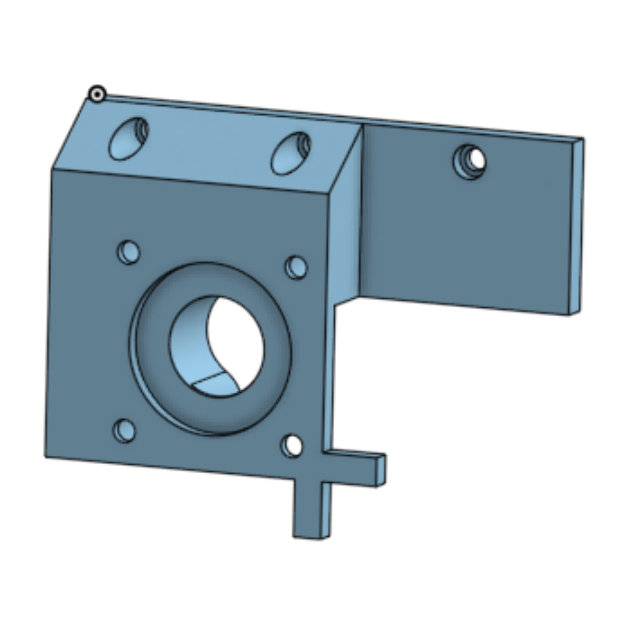
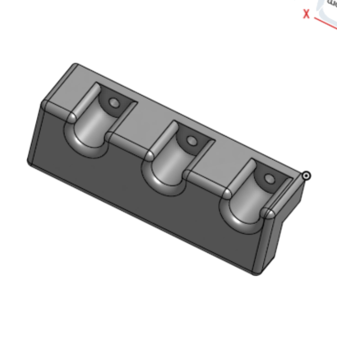
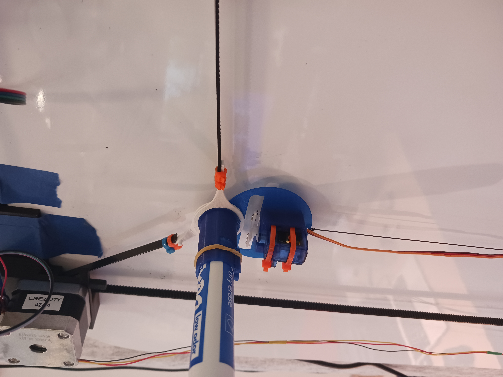

# All Designs
All of the designed were created with onshape. Onshape is free for hobby use, professional grade, web-based 3D design softwate. It's more freindly for beginers and you can copy and edit my designs there. You can access the onshape file here:
[OnShape Link](https://cad.onshape.com/documents/ab6b596e4392295efecd3ac1/w/dc93ebaf0ace8be6780ac9ec/e/0725e028e4da9825d101adc6?renderMode=0&uiState=6855ba55a5c94332b50f6fd7)

# Motor Brackets
These are designed to hold nema17 stepper motors. They are designed for Motors with a relativley short shaft(less than ~2cm) and a gear pulley with an outer diameter less than 1.75cm. They have a curved shape which helps to act as idlers and keep the belt from slipping. The left bracket has a cross that allows you to line up the gondola so the machine has a home position. See Usage intrctions for more info on how to home the machine.

# Motor Clips
There are holes on the MotorBrackets designed for M3 screws and a simple clip. This allows the motor brackets to rest on some kind of lip. This makes it easier to mount the Brackets on different surfaces.

# Gondola
This holds the Marker/pen and a servo. The servo rotates down to push the marker off the surface. There are 3 peices to this, two arms (white in the picture) that rotate and attach to belts, and one centerpiece (blue) that the other two rotate around. The center peice is desgined to hold an expo marker or a pen and adapter. It has points that bend so the pen can be held in place with a rubber band or a binder clip. See the picture below:

# Weights
There are desgins for specific weights for the machine. They use a lot of filament (around 1200 grams when printed with 100% infill) so they don't actually need to be printed. It should be noted that the center weight is tricky. It must have a center of gravity that is less than 1-2cm away from the whiteboard. The designed weight accomplishes this and a replacement weight must do something similar. This center weight helps to create pressure on the pen/marker. If the center of gravity is too far away from the white board, the pen/marker will not make good contact.

# Electronics Board
There is a design for an electronics board. It holds an arduino mega, has attachment points for the same clip as the motor brackets, and it has some other places to zip tie wires or attach other electronic boards.

# Pen Holder Adapter
There is also a pen holder Adapter. This fits into the gondola. The gondola is designed to hold a standard expo marker by default. This peice allows for a pen to be attached, and even held in place by an M2 screw if desired.
