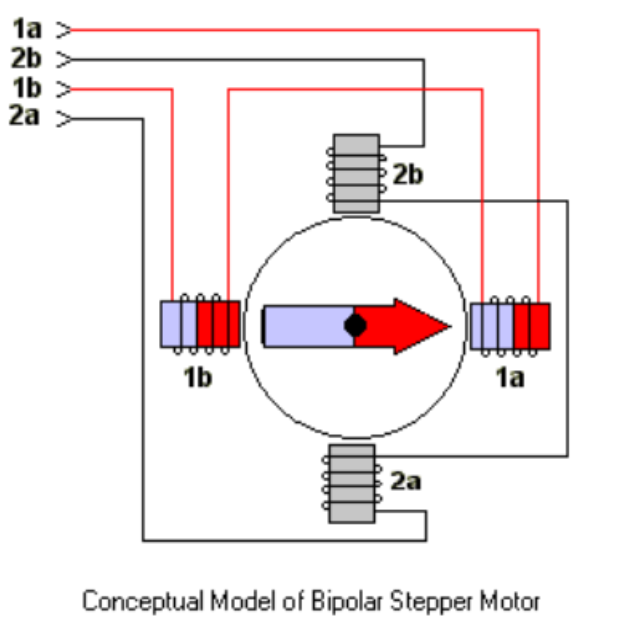

# Electronics
I used Nema17 stepper motors, a 9g servo, 3 Buttons, and and OLED screen. You can disable the OLED screen easily if you don't want that feature. One of the buttons is for an estop, the other two allow you to directly run some functions on the arduino, stuff like home, a specific gcode function stored on the arduino, pen up/down. etc. I reccomend an Arduino Mega for this project, but an Arduino Uno would likely work, and so would another reasonably powerful microcontroller if you know what you're doing.

## Motor Driver
This project uses a low cost motor driver. It uses nema17 motors and a knockoff of the AdafruitMotorSheildV1 (This can add some complexity). Some Nema17 motors tend to draw more current than the AdafruitMotorSheildV1 likes to provide. I wired 4 100 Ohm 1/4 watt resitors (in parallel to make 25 Ohms) in series with each coil of the nema17 motors (8 resistors per motor because there are 2 coils per motor). This is not ideal and can be avoided by using a lower current stepper motor (like the one linked below). It would also be relativley trivial to use a different motor driver update the arduino code as the accel steppers library is used. You simply need to update the functions that step each motor forward and backward.

[AdafruitMotorSheildV1 (called L293D driver) Driver](https://www.amazon.com/DiGiYes-Stepper-Expansion-Duemilanove-Raspberry/dp/B0BSN8FTH2/ref=sr_1_5?crid=37LG9X0GMNWRB&dib=eyJ2IjoiMSJ9.BbV2I91uP8kNiCR8qUUErpnvcY-mjm7UkP8vHHKBgf0AY0Wqim-9Oh49ey3xVt4mYjzSqQRVuxhrdfL062B78REtpE71hNN2zyUMHg942bJA85hdzDtcs15yJyVROMMxjp6lhZCDGhVby2WTP8p-cHxSsMI882VxKjau46uo1Hdy5SQX6T6mPxGqR7B1lDjglWVpIptfrl_S5UnTjJPrzOceMmSthWWLIDC_VjVf9Sg.mOxDNIRq-GfsAgHpZl8AQh9XOk_cvvbfX0yITdnKFps&dib_tag=se&keywords=adafruit+motorshield+v1&qid=1750509228&sprefix=adafruit+motor+shield+v1%2Caps%2C115&sr=8-5)

You will also need a power supply for the driver. This one is nice, I would set the input voltage to around 9v and then slowly increase as needed, keeping it less than 15v. The link has a power supply with a barrel jack, it also has an adapter with screw terminals need to connect the power supply to the motor driver.

[Barrel Jack Power for Driver](https://www.amazon.com/Adjustable-Universal-Switching-Minidodoca-Electronics/dp/B0C5QG946M/ref=sr_1_7?sr=8-7&th=1)

## Servo
I used a standard 180 degree 9g servo controlled with a PWM signal. Many motorsheilds have spot for these, if they don't, you can easily wire the servo directly to the arduino.
[9g Servo Example](https://www.amazon.com/10Pcs-Servos-Helicopter-Airplane-Controls/dp/B07MLR1498/ref=sr_1_3_sspa?crid=31QJ0GLC8TVW4&dib=eyJ2IjoiMSJ9.c3kL7Mek5QkgzM_eJhqvJdx-kWzSfWnOb3n9LuZv9z8_91MWPQ3lt2b5rPZxpxc-4d4S32NnBROa6eFHrz72s0QN6QOhR9ArJ9_msYR0kWXuP933Hi1peWBnBNdvg8JRHcnRJ5vtrAgyHv-MKeZUdxIiuZazKG5x5xNFozYKQPKO5yXrOr2fH0MRS6yxQaFoBpA76ZfPah24fFWPXAEuJPe4pHQC3QyIX-XiXkxmMwlus6_IXUdNHEJGeD66cTl-6t0Wd_fdaJUC6uEOYaD43DkAs2chwLgGHoaiO4OaNSA.IJ5wnKRpjPYPLDdNT_aJriEQHpbSjnLFOpNlelawHws&dib_tag=se&keywords=9g%2Bservo&qid=1750509383&sprefix=9g%2Bservo%2Caps%2C124&sr=8-3-spons&sp_csd=d2lkZ2V0TmFtZT1zcF9hdGY&th=1)

## Push Buttons
It has 3 physical pushbuttons (no hardware debounce or resitors needed). One is an EStop that will stop the machine at any point. Another is used to change a function, see manual functions below to get a list of the functions on the machine. The third will run the currently selected function. These give a user the ability to just run a GCODE file, without and kind of software/usb connection needed.
Note where the two sides of the buttons are. One side needs to be connected to ground, the other side to a digital input of the arduino. You can change the pins in the arduino in the code easily.

[Push Buttons](https://www.amazon.com/Gikfun-12x12x7-3-Tactile-Momentary-Arduino/dp/B01E38OS7K/ref=sr_1_5?crid=ROJIDUQNVB4R&dib=eyJ2IjoiMSJ9.OxX5zPjhX7ayPiyTV7oEOJ4fvym7au5K0DmLxoGEW1uk0sUmpTNckMExpnUsT950mOmg7mLLXZwHjXfU4VzPWbs2u9EoPs6q9egbW3BKeG84v6Pm3yuPsra17U6JmVzpyWhGZRraV4Qd2OQCbUKNlYmvxMZzTNR-J4jkEQMPkDhKLKJW4XjJyNwsiBrRvomfVz1o175FzedGT9nJPwHX8VXJENSVk4ViU4TssuPRVFU.x8UZg68K6edWSkS0vzvPls9SvmcWCtZIERaH0PD2imM&dib_tag=se&keywords=Push+Buttons&qid=1750509434&sprefix=push+buttons%2Caps%2C133&sr=8-5)

## Small OLED Screen
It also uses a single I2C 0.96 inch common OLED screen (128x64 pixels) to allow for some functions to be run directly on the machine. This is convenient feedback but can be easily disabled with a single MACRO (just comment out the #define OLED in the PolargraphGCODEController.ino file) in the arduino code. To wire up the OLED there are 4 pins, GND, +Vcc (typically 5 volts is preffered but 3.3 will work), SCL and SDA. SCL and SDA can only be on specific pins. Just look up the I2C pins of the microcontroller you're using. On a Mega SCL is digital pin 21 and SDA is digital pin 20.

Occasionally these OLED screens will have a different address than normal and if you've double checked the wiring and it still isn't working, check the OLED.ino file, look for the address 0x3C and change it to 0x3D.

[OLED Example Link](https://www.amazon.com/Hosyond-Display-Self-Luminous-Compatible-Raspberry/dp/B0BFD4X6YV/ref=sr_1_1?crid=10VTQZ4T1NDHH&dib=eyJ2IjoiMSJ9.CTaHo5AehlQA9qd6RFc-eu71gxCGjI3QsO05rN0arDZ9O4JU8TQqCNR68NvXXDzWwazQQ3eYNtYignli0arhWlW1vOzfcTR_DBUGTKlPNGgMtL26-_2kAaNTs6hP9vNk6dHhc_yfphyhvomljfga4qTM1DsIK-CuRM1qm0SgvatrS9SVztz-KjhDGOWXKbcpZ_l5l6fn-tgLAg2UII8BzO0z9T_Zd8sl-zlR-34N1zU.CuIjbNWG79Pq4nYCIW9nrGPg5QtM7s66oEbDA2sU8aQ&dib_tag=se&keywords=oled&qid=1750510398&sprefix=oled%2Caps%2C139&sr=8-1&th=1)

## Stepper Diagram 
Different Nema17 steppers can be wired differently and have different current draws so be careful. Many have colored wires that line up with the diagram below as follows:
Green and Red are paired
Black and Blue are paired

1a: Red
2b: Blue
1b: Green
2a: Black

You can check two wires are connected through a coil by seeing if a multimeter has no resistance over those two wires. Ex: Red and Green wires (with one wire connected to black test probe and the other connected to the red test probe) should show no resistance.

When using the AdafruitMotorSheildV1 each coil is connected to a different motor. (There are two screw terminals per motor). Ex: M1 should have 1a and 1b connected. M2 should have 2a and 2b connected. M3 might have 1a and 1b of another motor, etc.

[Stepper Motor Link](https://www.amazon.com/BESJMYT-Stepper-0-80inch-Engraving-1-66x1-66x0-81inch/dp/B0D22GZFPC/ref=sr_1_1_sspa?crid=1TBPT441WRSK4&dib=eyJ2IjoiMSJ9.Qa3CQUjLdgK6uEHpJhtsnJiWMqA2lMAgrKIK_BIqEz_3hVqSclmnOdSJrw0yrWOHyIdkYGomxOXDp2-_YLIPPB0VF4kUWo6CjXK6qLLkC3rkiNRZBVfISOsDRmI8h2hsQ9yElLAoMDbEXGBZOZxEwruonczY_2hwgbd9WCI1y9jiHlUBY5FnrYthOgIK2gCIM_L-_lV23ZEenuB7RsRh93J28PTRYL9hLrGEbItv9BQ.2sAkPIgQMHGGxnfLBNvxiSwZSjje9zlLDy-TM_q0fow&dib_tag=se&keywords=Nema17%2Bmotor&qid=1750510456&sprefix=nema17%2Bmotor%2Caps%2C120&sr=8-1-spons&sp_csd=d2lkZ2V0TmFtZT1zcF9hdGY&th=1)

