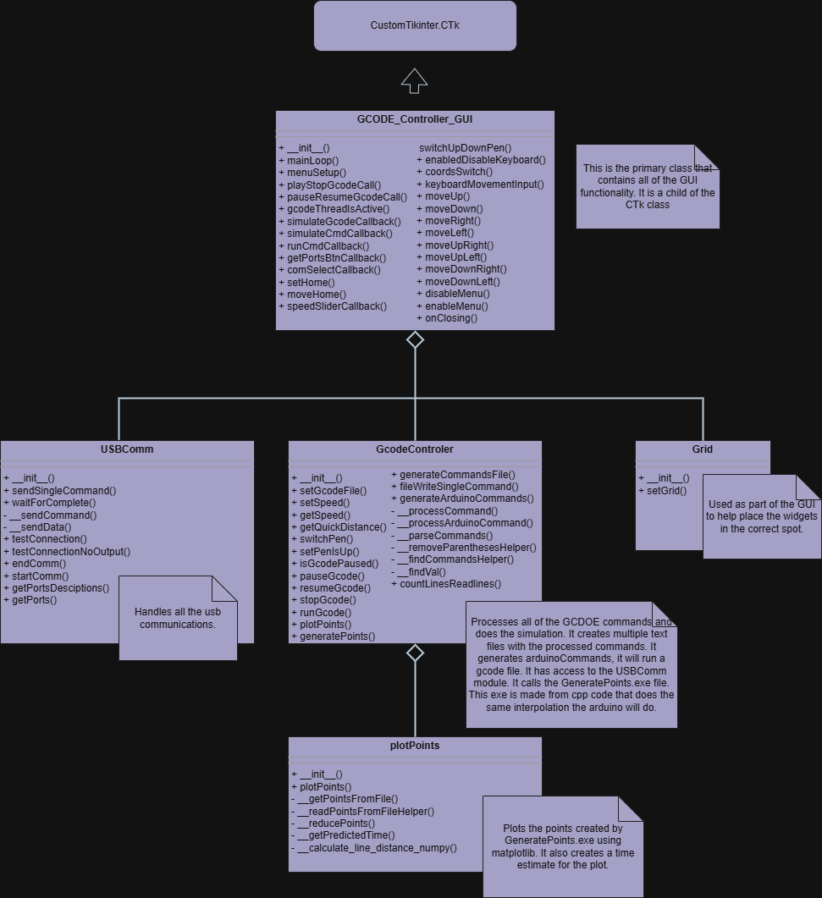

## Some General Notes
This contains all the Python Code for the GUI. It is here if adjustments need to be made and/or if it needs to be run from source. It is not intended to explain how to use the application, that is in the maind README of this project. You can ignore the polargraphCmds.txt, points,txt, and ArduinoCommands.txt. There are all generated at runtime and are not needed for the build.

## Python Requirements
Python 3.11.0
pip install customtkiner (version 5.2.2)
pip install numpy (version 3.3.6)
pip install matplotlib (version 3.10.3)
pip install keyboard (version 0.13.5)
pip install pyserial (version 3.5)

## The Build
This project was built into an executable using pyinstaller. It was built for windows 64 bit. Here is the full command:
pip install pyinstaller
pyinstaller --onefile --noconsole --add-binary ".\\GeneratePoints.exe;." --add-binary "c:\\mingw\\bin\\LIBSTDC++-6.DLL;." --add-binary "c:\\mingw\\bin\\LIBGCC_S_DW2-1.DLL;." --icon ".\\Plotter_Icon.ico" --add-data ".\\Plotter_Icon.ico;." --name GCODE_Plotter  main.py

## Code Overview
The code uses a design where there is a single instance of the application class (GCODE_Controller_GUI). This instance contains the Gcode Module and Comms modules instances. 

The USBComm module (Comms module) has two purposes, it shows the available devices and connects to them. It also sends commands to the usb device. There is a handshake that happens between the device and the code to ensure the correct commands was received. 

The GcodeController module (GCODE module) is a lot more involved. It contains functions for parsing the gcode commands. When a simulation is ran, the GCODE module creates the polargraphCommands.txt (the Cxx commands that will be run on the device) and the ArduinoCommands.txt. ArduinoCommands.txt is not used by the python application. It is code that could be copied into the arduino code, so short gcode files can run directly on the arduino with no USB connection. 

The polargraphCommands.txt is used by the GeneratePoints.exe binary. This binary is compiled cpp code, and generates points.txt using polargraphCommands.txt. The cpp code is the same code that the arduino uses to interpolate between points. GeneratePoints.exe is called by the GcodeController module and is just used for the simulation.

The GcodeController module also runs a gcode file ("run" reffering to sending the commands over usb to the arduino in sequential order). It does this in a seperate thread so the application can continue to run. It allows for the gcode file to be paused or stopped. The threading is handled in the GCODE_Controller_GUI class.

In the application class (GCODE_Controller_GUI) there is also a mainLoop fucntion. This is seperate from CTk.mainloop() function. This function is called every self.mainLoopUpdate ms. It does a couple different things, but it's primary purpose is to update the userFeedbackLabel. There is a queue of text feedbacks, and when a new one is added to the queue, this loop updates the label. This function also handles the keyboard feedback. The device can be jogged around using the arrow keys and spacebard. When that feature is enabled, this loop also checks the keyboard and moves the device accordingly.

It should also be noted that the UML was partially created using this project: https://github.com/siddharthverma-1607/uml-class-diagram-generator/tree/master