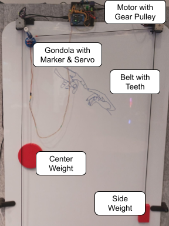
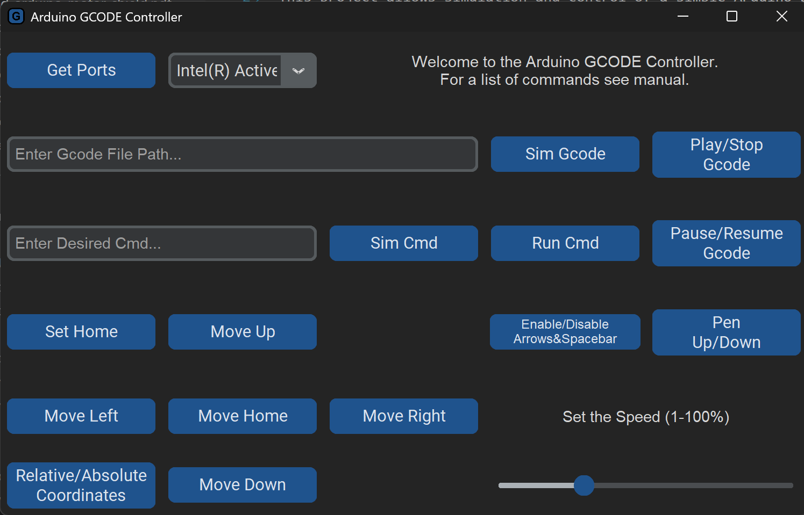
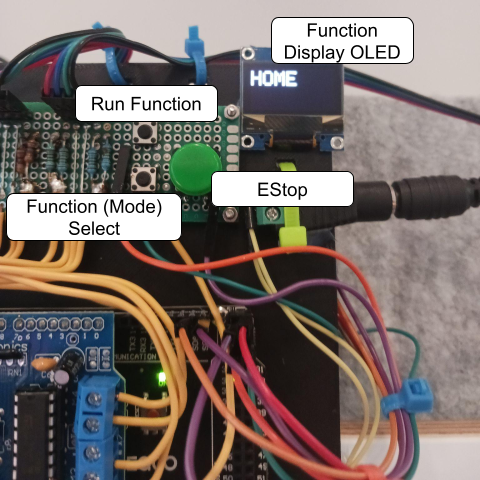
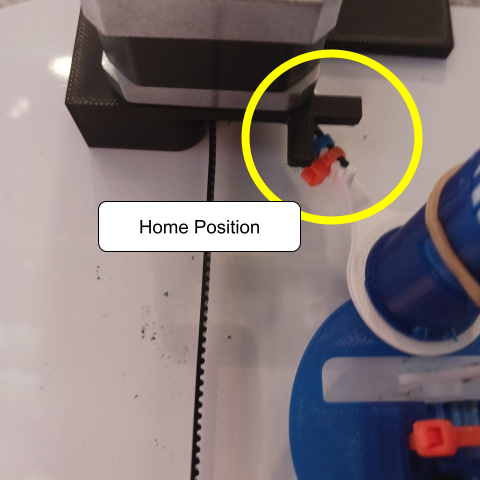

# GCODE_Plotter_Polargraph
This project allows simulation and control of a simple Arduino based GCODE device, intended to be used for pen plotting. Besides the application executable and source code, it includes Arduino code, 3D Models, and Electronics that make a polar plotter. Inspired by the Polargraph project found at https://github.com/euphy/polargraphcontroller/releases/tag/2017-11-01-20-30. 

# Intended Use
This was built as a way to create a polargraph pen plotter that is as cheap and simple as possible, while also having a reasonable amount of functionality. The gcode controller could easily control a pen plotter that is not a polargraph plotter as well, as it works with standard GCODE commands. The arduino code would just need to be updated to control a different stepper motor. There is also a single function in the arduino code that converts the X/Y coordinates into physical positions on the stepper motor. 

This project allows you to both run files on the arduino directly (assuming the files are small enough) and run files over usb.

This documentation is split into folders as there is a lot of different parts to this project. Each folder should have it's own markdown file.

For this project all units are in millimeters. 

This project is intended for a Windows machine, but could be adapted for a Linux or Mac device with some work.

# Plotter Diagram 
Here is a diagram of the plotter itself. The application could be used for a different plotter potentially, but much of the documentation is for this specific plotter.

# Video Demo
[Link](https://youtu.be/lAycF0MGN9o)

# Aplication Features
Here is what the application looks like:

The application has a number of features. It allows you to select the comm port of the usb device. It has a button "Get Ports" if a new device is added while the application is open. 

The application allows you to simulate and run GCODE commands. Simply add the file location to the .ngc or .txt file containing the gcode file. Then you can select the simulate file. If a USB device is connected, you can run the gcode file as well, along with pausing the file while it's running.

The application allows you to send and simulate individual commands. These commands must be of the format Cxx with commas separating the values of the command. The Cxx is similar to Gxx but is different as the arduino only implements a limited set of GCODE commands. ex. C01,50,-50 would move the plotter to 50,-50 mm.

The application allows you to jog the plotter around. There are buttons to do this or you can enable the keyboard and use the arrow keys and spacebar (space bar raises/lowers pen).

The application also allows you to set the speed. The slider only goes from 1-50, but the C07 command allows you to go past that to the 50-100 range.

# Accepted Commands
| Cxx | Description |
| :------------- | :---------- |
| C00,X,Y | Rapid Positioning |
| C01,X,Y | Linear Interpolation |
| C02,X,Y,I,J | Circular Interpolation Clockwise |
| C03,X,Y,I,J | Circular Interpolation Counter Clockwise |
| C04 | Pause GCODE File (does nothing if sent to arduino. Intended so that G04 can be added to GCODE file) |
| C05,X,Y | Move Relative: Moves directly to a position relative to current position (X, Y away) |
| C06 | Home - Moves the device to the home position |
| C07,SPEED | Sets the speed from 1-100% (is 1-100 mm/sec if the device has same stepper motors as this design) |
| C08\C09 | Unused |
| C10 | Pen Down |
| C11 | Pen Up |
| C12 | Stop Motors: turns off power to the motors |
| C13 | Enable User Input: Enables the mode select and run buttons |
| C14 | Disable User Input: Disables mode select and run buttons. Does not disable Estop button |
| C15 | Test Gcode: Runs the test gcode program |
| C16 | Set Home Position: Sets the position to be 0,0 and resets stepper motors to be at their home position. |
| C90 | Set Absolute Position: Sets the C00-C03 commands to use absolute positioning |
| C91 | Set Relative Position: Sets the C00-C03 commands to use relative positioning |

# User Input
In this project there are 3 buttons and a feedback OLED screen. These can be disabled if they don't want to be used. See the Electronics.md file. The function select changes the function that is shown on the OLED and that the run button will run. The run button runs the currently selected function. The functions include things like Home, Set Home, Pen Up/Down, and custom GCODE files loaded onto the arduino. This way the plotter can work on it's own without USB connection to a PC.

# Home Position
The 3D models include an arm with a peg and a motor bracket. The plotter should be moved so the peg lines up with the cross on the bracket as in the image below. This is the home position of the machine.

